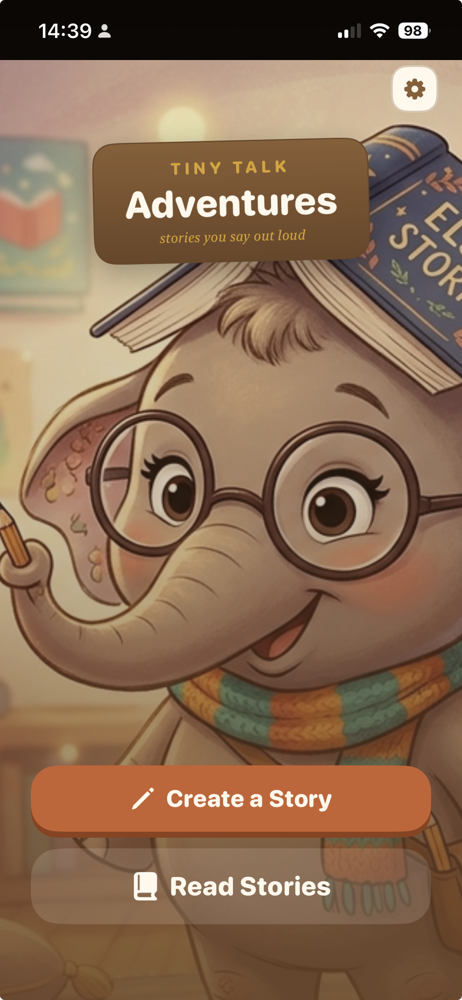
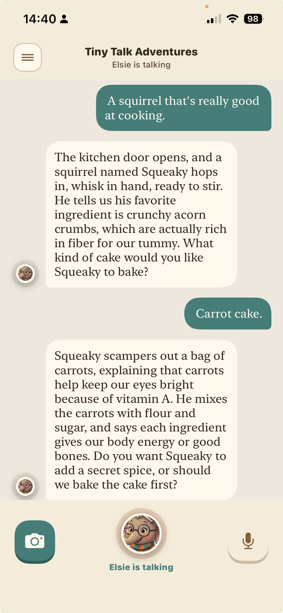
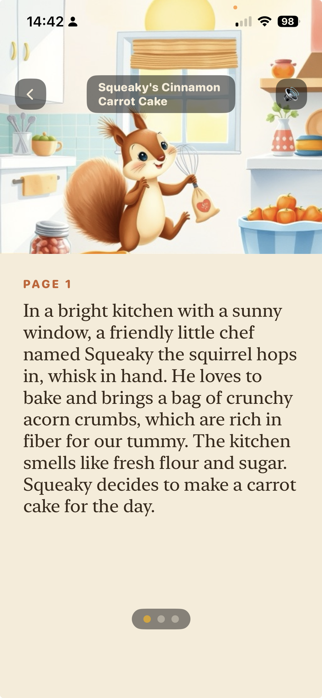
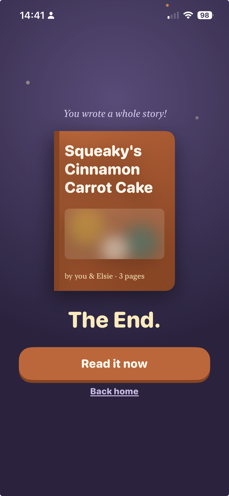
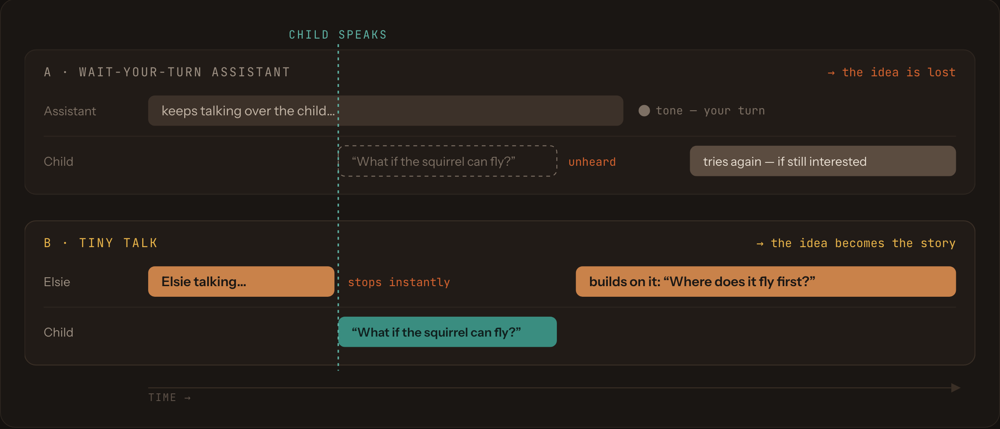
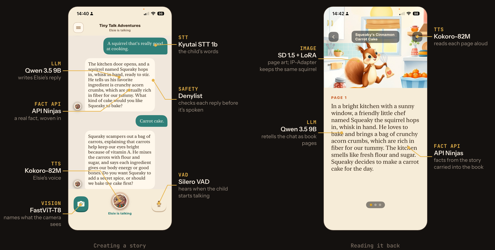

# Tiny Talk Adventures

**A child talks. Six models answer. Nothing leaves the house.**

A voice-first story app for kids. A child and Elsie the elephant make up a
story together, out loud, and the child can cut in at any moment with a
better idea. Afterwards, the conversation becomes an illustrated picture
book. Speech recognition, the language model, the voice and the artwork all
run on one M1 MacBook Pro with 16 GB of RAM, on the family's own WiFi.

**→ [Read the project write-up](https://jessvb.github.io/tiny-talk-adventures/)**:
how it works, the hard problems, the Claude Code workflow, and what it would
take to scale.

<p align="center">
  
  
  
  
</p>

This is a personal project, built for one family. It isn't meant to scale or
ship.

## Why

Three reasons this exists:
- Learning how to build an interruptible, low-latency voice dialog system
- Learning to build with Claude Code
- Building something real for my kiddo to play and learn with

## How it works

### The child can always interrupt

Young children think out loud and cut in halfway through your sentence. Most
voice assistants make you wait for your turn; Tiny Talk stops the moment the
child speaks and builds on what they said. Stopping is decided on the phone
itself, with no network round trip.



### Every element on screen is backed by a model



### Architecture


- **Phone** (iPhone 13 Pro): on-device voice-activity detection (Silero
  VAD) for near-instant barge-in, echo cancellation, playback, and on-device
  object recognition (FastViT-T8 via Core ML) that brings real objects from
  the child's room into the story. Photos never leave the phone; only the
  label does.
- **Home server** (M1 MacBook Pro, 16 GB): streaming speech-to-text (Kyutai
  STT 1b on MLX), the storyteller (Qwen 3.5 9B via Ollama), a deterministic
  safety gate on every reply, and Elsie's voice (Kokoro-82M). After the story
  ends it rewrites the chat as picture-book pages and illustrates them
  locally (Stable Diffusion 1.5 + a storybook LoRA + IP-Adapter, so the same
  character appears on every page).
- **Outside the home:** real animal facts come from API Ninjas and are
  cached after the first lookup. An optional **away-from-home demo mode**
  swaps in hosted models (Groq, Cloudflare Workers AI) when there's no home
  Mac, and a clearly worded setting tells grown-ups when it's on.

Phone and server share one WebSocket: JSON control frames plus raw 24 kHz
PCM16 audio, with a turn id on every frame so late replies to an abandoned
utterance get dropped. A client must send its `speech_start`/`interrupt`
control frame *before* that utterance's audio frames. Audio that arrives
outside a listening state is silently dropped (see
`server/tinytalk/protocol.py`'s module docstring).

For the reasoning behind each choice, and what each one cost, see
[The system](https://jessvb.github.io/tiny-talk-adventures/#architecture) and
[Development journey](https://jessvb.github.io/tiny-talk-adventures/journey.html).

## Status

The app was built as a sequence of independent sub-projects. Each one got a
written design spec (`docs/superpowers/specs/`) and a plan
(`docs/superpowers/plans/`) before any code. All of these are merged and
confirmed on a real phone:

- **Voice/dialog pipeline**: interruptible speech I/O between the phone and
  the Mac server, plus the iOS client
- **Story generation engine**: a five-stage narrative arc over a turn
  budget, with deterministic safety scaffolding
- **Animal facts retrieval**: fetched once per animal, then cached
- **Object recognition**: camera → on-device classifier → story guidance
- **Kid-facing UI**: onboarding, landing, story, library, reading, The End
- **Storybook persistence and page art**: the conversation retold as
  illustrated pages, with character-consistent local illustrations
- **Story length settings**: parent-adjustable turns and pages
- **Away-from-home demo mode**: hosted models behind one switch, with
  storybooks and illustrations synced back home

Android (Pixel 3) is a secondary target that hasn't been started. For current
bugs and follow-ups, see the
[issue list](https://github.com/jessvb/tiny-talk-adventures/issues).

**Known constraint:** running every model at once is tight on a 16 GB Mac.
Close other memory-heavy apps for a fair test (see "Running the server"
below).

## Read more

The project site has four short write-ups:

| Page | What's in it |
|---|---|
| [The system](https://jessvb.github.io/tiny-talk-adventures/) | What it does, where each model fits, and an interactive architecture diagram |
| [Development journey](https://jessvb.github.io/tiny-talk-adventures/journey.html) | Four real problems: the "random disconnects" that were really a realtime-throughput problem, a three-minute "thinking" silence, a PyTorch segfault that was my own race condition, and barge-in regressions |
| [Working with Claude Code](https://jessvb.github.io/tiny-talk-adventures/claude-code.html) | Context hand-offs, parallel worktrees, design before code, and batching fixes so testing happens once |
| [What if?](https://jessvb.github.io/tiny-talk-adventures/what-if.html) | What would change on the App Store, in a classroom, offline on a budget tablet, and for every child |

## Setup

The home server is implemented under `server/`. This section covers how to set up the environment to run it.
Commands verified 2026-08-13; re-check versions if it's been a while.

**Isolation policy:** nothing for this project is ever installed into
system Python or a global environment. Python version selection is pinned
per-directory via [pyenv](https://github.com/pyenv/pyenv) (`server/.python-version`),
and every Python package — including `tinytalk` itself — lives in
`server/.venv`, created fresh by the steps below. The one exception is
system-level tooling that isn't a Python package and has no meaningful
"environment" of its own: Ollama and espeak-ng are installed via Homebrew,
same as any other CLI tool on the machine. (Docker was considered and
rejected for this project: Kyutai STT's MLX backend needs direct access to
Apple's Metal/Neural Engine hardware, which Docker Desktop on macOS cannot
provide — containers there run inside a Linux VM with no Metal passthrough.)

### Mac server prerequisites

1. **Homebrew** (if not already installed): https://brew.sh
2. **pyenv** — manages the pinned Python version without ever touching
   system Python:
   ```
   brew install pyenv
   pyenv install 3.12.12   # matches server/.python-version
   ```
   `cd server` will then auto-select 3.12.12 via `.python-version` — no
   `brew install python@3.12`, and no relying on whatever `python3` already
   resolves to on your machine.
3. **espeak-ng** — required by Kokoro TTS:
   ```
   brew install espeak-ng
   ```
4. **Ollama** — local LLM runtime:
   ```
   brew install ollama
   ollama pull qwen3.5:9b
   ```
   Note: Ollama's newer MLX backend (added March 2026) needs 32GB unified
   memory. On this 16GB M1, Ollama will use its default Metal backend
   instead — that's expected, not a misconfiguration.

   qwen3.5 defaults to "thinking" mode — a long internal chain-of-thought
   before it ever produces a reply (confirmed on real hardware: 100+
   lines and ~3m19s for one prompt, via `ollama run qwen3.5:9b` directly).
   `config.OLLAMA_THINK` defaults to `False` specifically to disable this
   (see that setting's comment), which is what actually makes this usable
   at real-time latency — a smaller model was tried first and wasn't
   the real fix. With thinking off, 9b gives noticeably better-reasoned
   replies than 4b at acceptable latency on this 16GB Mac; if memory
   pressure becomes a problem again, `TINYTALK_MODEL=qwen3.5:4b` is the
   fallback.
5. **Kyutai STT** (MLX build) — already declared in `server/pyproject.toml`;
   no manual installation needed. It will be installed automatically in step 3
   of "Running the server" below when you run `pip install -e ".[dev]"` inside
   the venv. Once the venv is active, you can test it standalone:
   ```
   python -m moshi_mlx.run_inference --hf-repo kyutai/stt-1b-en_fr-mlx <audio-file> --temp 0
   ```
   The 1b is the default rather than the 2.6b for a hard reason, not a
   preference: measured on this Mac, the 2.6b decodes 1.7-2.3x *slower*
   than realtime, so audio piles up faster than it can be transcribed and
   the turn never starts. The 1b runs at 0.77x realtime. See
   `STT_HF_REPO`'s comment in `server/tinytalk/config.py`, and check any
   change with `server/tools/stt_realtime_probe.py` (exits non-zero if the
   configured model cannot keep up).
6. **Kokoro TTS** — also already declared in `server/pyproject.toml`; no manual
   installation needed. Like Kyutai STT, it installs automatically with
   `pip install -e ".[dev]"` in step 3 of "Running the server" below.

### Phone (iOS) prerequisites

- Xcode (latest stable) — for building/running the iPhone 13 Pro client
- An Apple ID added to Xcode for on-device deployment (required to run a
  dev build on a physical iPhone rather than the simulator — needed here
  since mic/speaker/camera hardware testing requires a real device)
- iPhone and Mac on the same home WiFi network; the phone app will connect
  to the Mac's local IP address (`ifconfig | grep inet` on the Mac to find it)

### Android (Pixel 3) — secondary target

Not yet scoped in detail; deferred until the iOS path is working. Will need
Android Studio and likely separate VAD/audio tuning given the older hardware
(see the design spec's non-goals).

### Running the server

**Known constraint:** all three models (Kyutai STT, Ollama/Qwen, Kokoro TTS)
together need close to the full 16GB on an M1. Close other memory-heavy
apps (browsers, IDEs, VMs) before testing — with them running, expect slow
replies or an occasional failed turn from Ollama specifically, not from
this server's own code. See the design spec's "Open questions / risks" for
what was actually measured.

This is not just a latency concern. Audio arrives from the phone at exactly
realtime and there is no way to slow a talking child down, so STT that
decodes slower than realtime falls behind without bound and the turn never
starts. That was the root cause of the long-running "app randomly
disconnects" bug (see `STT_HF_REPO` in `server/tinytalk/config.py`), and
memory pressure makes it worse: a swapped-out model's worst decode step
measured 1682ms against 92ms for a resident one. To check the machine's
current state at any time:

```
cd server && .venv/bin/python tools/stt_realtime_probe.py
```

It prints the realtime factor and the swap situation, and exits non-zero if
STT cannot keep up. If it fails, close memory-heavy apps and re-run before
suspecting anything else.

**First setup (one-time only):** Create the virtualenv and install all
dependencies (`tinytalk` itself, Kyutai STT, Kokoro TTS, and test tools) —
this is the only place anything gets installed:

```bash
cd server
python3.12 -m venv .venv
source .venv/bin/activate
pip install -e ".[dev]"
```

> **Copy-pasting commands from this README:** paste each code block as a
> whole, not line-by-line with extra text appended. If your shell is zsh
> (the macOS default — check with `echo $SHELL`), it does **not** treat a
> trailing `# comment` as a comment inside an interactive command the way
> bash does; anything after `#` gets passed as a literal extra argument
> instead. That's why these commands are written with no inline comments.

**Every time you open a new terminal:** Activate the venv before running
server commands:

```bash
cd server
source .venv/bin/activate
```

The `source .venv/bin/activate` command tells your shell to use the venv's
Python and packages for that terminal session. Every subsequent command in
this README assumes the venv is active. If you see `command not found` for
something Python-related, the venv is probably not active — run the
activation command above.

**Optional: animal facts API key.** Real animal facts get woven into the
story when the child mentions a known animal (fox, elephant, dolphin, and
others — see `server/tinytalk/animal_facts.py`), fetched from a free
[API Ninjas](https://api-ninjas.com) account (100 requests/hour free tier).
Sign up, then export the key before starting the server:

```bash
export ANIMAL_FACTS_API_KEY=your-key-here
```

Without it, animal fact lookups silently no-op — the story still works
fine, it just never gets fact-grounding for the animals it mentions.

Then, three terminals:

**Terminal 1 — Ollama:**

```bash
ollama serve
```

If this fails with `address already in use`, Ollama is already running as a
background process (common if it's installed as a menu-bar app or login
item) — that's fine, nothing more to do here. Confirm with
`curl http://127.0.0.1:11434/`, which should reply `Ollama is running`.

**Terminal 2 — the voice/dialog server:**

```bash
cd server && source .venv/bin/activate && python -m tinytalk.app
```

To let a parent switch stories to Groq's cloud LLM from the phone (hidden
"Elsie's Brain" card in Settings — long-press "UNDER THE HOOD"), start the
server with a free Groq key from https://console.groq.com/keys instead:

```bash
cd server && source .venv/bin/activate && GROQ_API_KEY=gsk_your_key_here python -m tinytalk.app
```

Without `GROQ_API_KEY` everything stays local and the phone's card says so.
With Groq picked, story text (not audio) goes to Groq's servers.

**Terminal 3 — the CLI test client** (stands in for the phone). Record a
test utterance, then run a full turn, then try a barge-in interrupt:

```bash
cd server && source .venv/bin/activate
say "tell me a story about a brave little fox" -o /tmp/utterance.wav --data-format=LEI16@24000
python tools/test_client.py /tmp/utterance.wav
```

```bash
python tools/test_client.py /tmp/utterance.wav --interrupt-after 0.8
```

```bash
afplay /tmp/reply.wav
```

Run the tests with `cd server && source .venv/bin/activate && pytest`.

### iOS client

#### Prerequisites

- Your iPhone and your Mac must be on the **same WiFi network**. Cellular
  data, a guest network, or a VPN on either device will prevent the phone
  from reaching the Mac.
- The server must already be running on the Mac (see "Running the server"
  above — you need Terminal 1 and Terminal 2 up; you don't need the CLI
  test client from Terminal 3 for this).
- An Apple ID (free tier is fine) to sign the app for your device in Xcode.

#### One-time setup

```bash
brew install xcodegen
cd ios/TinyTalkApp
cp Local.xcconfig.example Local.xcconfig
xcodegen generate
open TinyTalkApp.xcodeproj
```

`Local.xcconfig` is gitignored — it's how your own Apple Developer Team ID
stays out of the committed project file. `xcodegen generate` needs the file
to exist (even with its placeholder value untouched) or it fails with an
"Invalid config file" error; you don't need to edit it by hand, since the
next step sets your team from Xcode's UI anyway and that overrides it.

In Xcode: select your iPhone as the run destination (not the Simulator —
mic/VAD/AEC need real hardware), set your team under Signing & Capabilities
so it can be installed via your free Apple ID, and Run. On first launch,
grant microphone access when prompted — the app can't function without it
and will show a clear on-screen error if you deny it (Settings > Privacy >
Microphone to change your mind later).

#### Finding your Mac's address

The app needs your Mac's actual LAN IP, not its hostname and **not your
router's address**. On the Mac:

```bash
ifconfig | grep "inet " | grep -v 127.0.0.1
```

This prints one or more lines like `inet 192.168.1.185 netmask ...` — use
that IP. A common mistake: typing something like `192.168.1.1`, which is
almost always your **router's** gateway address, not your Mac's — the app
will connect to nothing and time out or show "disconnected from server".
If you see more than one `inet` line (e.g. WiFi and Ethernet both active),
use the one on the same subnet as your phone.

#### Connecting

In the app, enter `ws://<your-mac-ip>:8765` (matching `SERVER_PORT` from
`server/tinytalk/config.py`, 8765 by default) as the server address and tap
Connect. On success the state line changes from `idle` to reflect the
conversation as it happens. The address is remembered between launches, so
you only need to type it once per Mac.

#### Troubleshooting

- **"Error: disconnected from server", state stuck at `idle`:**
  - Double-check the IP — this is by far the most common cause. Re-run the
    `ifconfig` command above and compare it exactly to what's typed in the
    app; a stale IP from last time you were on a different WiFi network
    (e.g. a coffee shop) is a frequent trap.
  - Confirm the server is actually running and listening:
    `lsof -i :8765` on the Mac should show a `python3` process with
    `LISTEN` state. If nothing's there, Terminal 2 isn't running or
    crashed — check its output for errors.
  - Confirm both devices are genuinely on the same WiFi network (not one
    on 5GHz-only guest and one on the main network — some routers split
    these into separate subnets that can't reach each other).
  - macOS's firewall (System Settings > Network > Firewall) can silently
    block incoming connections to the Python process — either allow it
    when prompted, or temporarily disable the firewall to confirm this is
    (or isn't) the cause.
- **"could not start audio capture" / a permissions error:** you denied
  the microphone prompt. Go to Settings > Privacy & Security > Microphone
  on the phone, enable it for this app, and relaunch.
- **"failed to load VAD model":** the bundled `silero_vad.onnx` file failed
  to load — this shouldn't happen from a normal build (the file is
  committed and bundled by `project.yml`), so if you hit this, it's worth
  re-running `xcodegen generate` and a clean build
  (Xcode: Product > Clean Build Folder) before digging further.
- **Ollama-related errors in Terminal 2's output:** see the Ollama note in
  "Running the server" above — `address already in use` when starting
  Ollama separately usually just means it's already running.

#### What to actually test

1. **Happy path:** tap Connect, wait for `idle`, then talk. State should
   move `idle` → `listening` while you're talking → `waitingForReply` once
   you stop → `speaking` as the reply plays → back to `idle`. Check "Heard:"
   and "Reply:" show real text each turn.
2. **Barge-in — this is the actual point of this whole sub-project:**
   while the agent is speaking, talk over it. Playback should stop audibly
   *instantly*. Check the on-screen `VAD→stopped` latency list — that
   number is the real, on-device answer to whether barge-in feels instant
   enough for a child, which is something no amount of automated testing
   or Mac-only simulation could tell you in advance.
3. If barge-in doesn't fire, fires late, or falsely triggers on the
   agent's own voice (a sign AEC isn't fully suppressing echo), that's
   real signal — the VAD's probability threshold and hangover window in
   `VoiceActivityDetector.swift` are untuned defaults specifically pending
   this kind of on-device feedback. Expect to adjust them by ear.

## Repo layout

- `server/`: the Mac home server (Python). `tinytalk/` is the package,
  `tests/` the pytest suite, and `tools/` holds the CLI test client and
  hardware probes. `server/.python-version` pins the pyenv Python version;
  `server/.venv` (gitignored) is where all Python dependencies live. See the
  Setup section's isolation policy.
- `ios/TinyTalkApp/`: the iPhone app (SwiftUI, generated with XcodeGen).
- `ios/TinyTalkCore/`: a Swift package with the app's logic (`TinyTalkCore`)
  and its device-facing pieces: audio, VAD, object recognition
  (`TinyTalkPlatform`).
- `docs/superpowers/specs/` and `docs/superpowers/plans/`: one dated design
  spec and implementation plan per sub-project.
- `site/`: the static project website, deployed to GitHub Pages by
  `.github/workflows/pages.yml` on every push to `main` that changes it.
- `docs/images/`: diagrams used in this README, rendered from the site.

## Development

See `CLAUDE.md` for project conventions and context for AI-assisted
development in this repo.

## License

Copyright (c) 2026 Jessica Van Brummelen. **All rights reserved.** This
repository is public so people can read it, but no license to reuse it is
granted; see `LICENSE`. Bundled and downloaded third-party components keep
their own licenses; see `THIRD_PARTY_NOTICES.md`.
